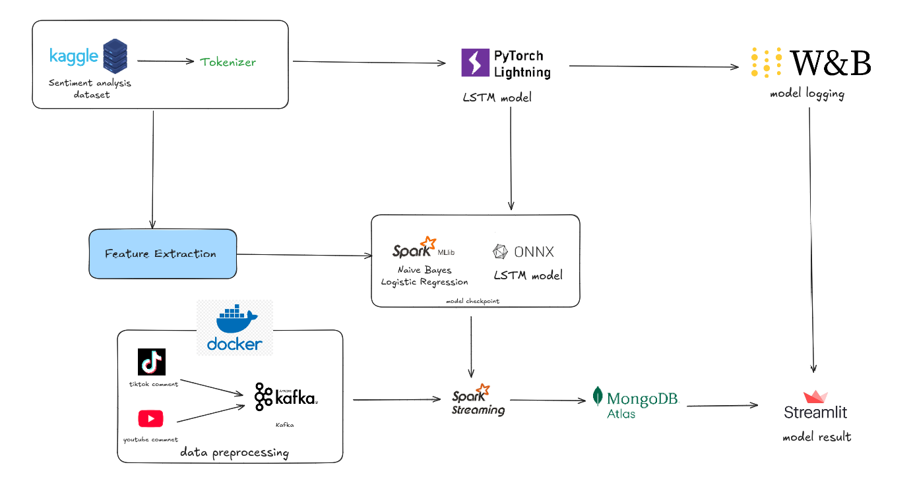
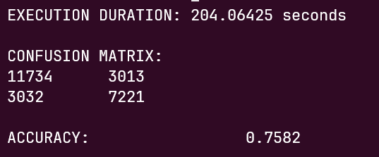
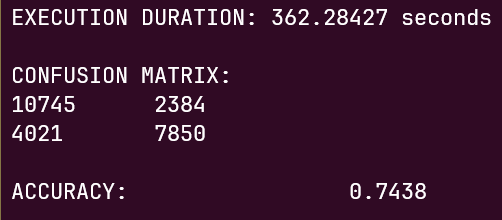
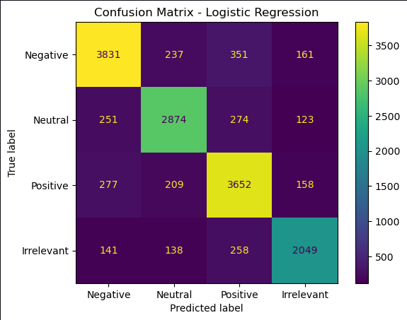
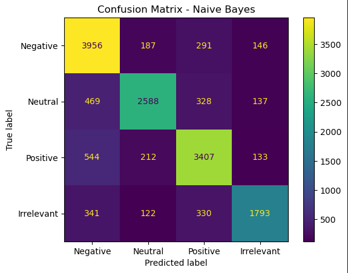
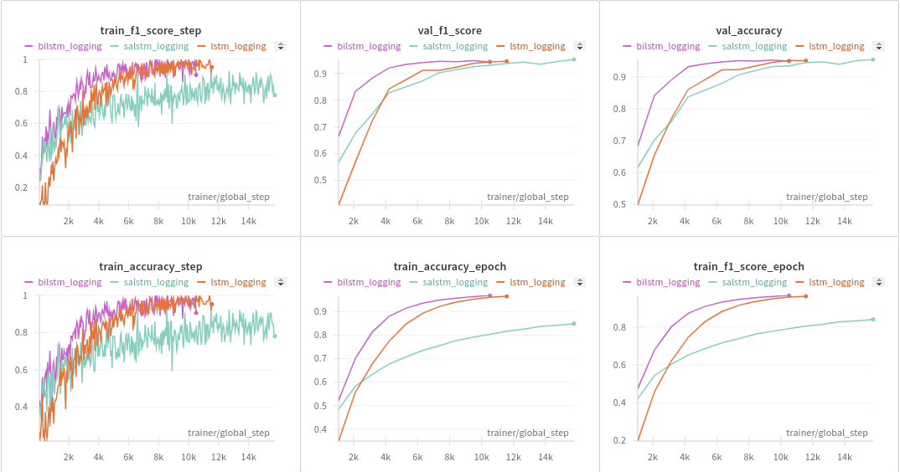
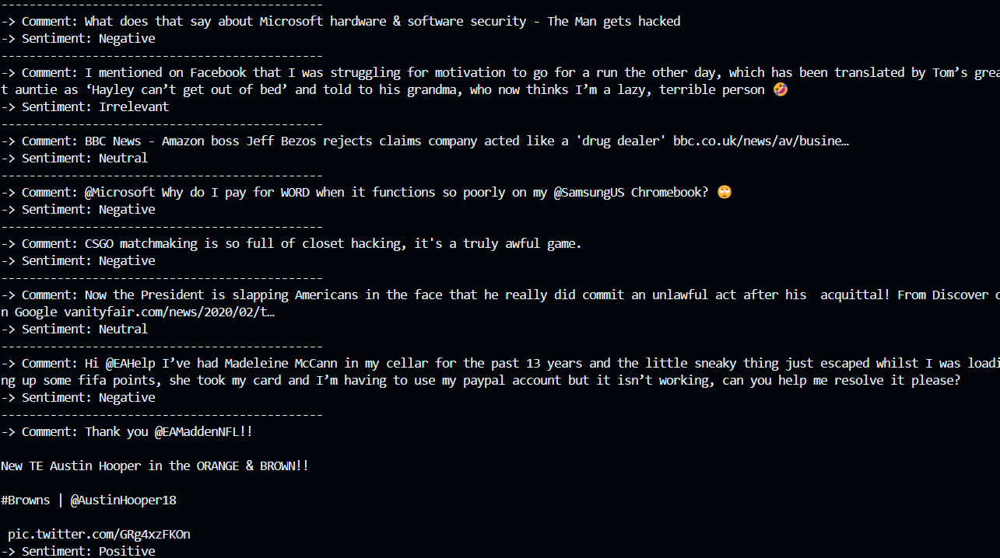

# BigText Sentiment Analysis 

## Tổng quan 
Phân tích cảm xúc (Sentiment Analysis) là một bài toán nổi tiếng trong lĩnh vực xử lý ngôn ngữ tự nhiên, bài toán này thường được áp dụng để phân tích phản hồi của người dùng trên mạng xã hội, đánh giá sản phẩm, ý kiến khách hàng,.. Trong repo này, chúng tôi thực hiện cài đặt và thử nghiệm một số thuật toán phân tích cảm xúc và ứng dụng một số công nghệ trong việc thu thập, phân tích và đưa ra kết quả trong thời gian thực. 


## Kiến trúc dự án 

<p align="center">
  
</p>

Dự án được xây dựng dựa trên các thành phần như sau: 

1. **Khối xử lý dữ liệu** : Sử dụng Kafka (thông qua Docker) nhằm truyền dữ liệu trực tiếp từ các comment bài viết trên TikTok và Youtube từ API có sẵn. 

2. **Khối Huấn luyện mô hình** : Các mô hình được huấn luyện từ bộ dữ liệu 
[Twitter Sentiment Analysis](https://www.kaggle.com/datasets/jp797498e/twitter-entity-sentiment-analysis) được công khai trên Kaggle. Chúng tôi sử dụng 2 hướng tiếp cận, đó là sử dụng các mô hình học máy thông qua thư viện Pyspark và các mô hình học sâu từ thư viện pytorch. 

3. **Spark Streaming** : các mô hình được huấn luyện trước đó được load và xử lý real time thông qua Spark 

4. **MongoDB Altas** : Kết quả của mô hình lưu trữ thông qua MongoDB 
5. **Streamlit** : Các kết quả đánh giá mô hình (accuracy, ..), giao diện tương tác trực tiếp với mô hình được biểu diễn thông qua module này. 


## Tính năng 

1. Thu thập dữ liệu theo thời gian thực thông qua Kafka và đưa ra dự đoán theo thời gian thực 
2. Cài đặt và thử nghiệm trên nhiều loại mô hình khác nhau: Thuật toán Naive Bayes sử dụng Hadoop, thuật toán học máy (logistric regression, naive bayes) thông qua mllib và các mạng LSTM học sâu
3. Sử dụng Streamlit trực quan hóa các metrics của mô hình và cung cấp giao diện tương tác cho người dùng 
4. Sử dụng MongoDB Altas để lưu trữ kết quả. 


## How to run 

Đầu tiên cần cài đặt các thư viện cần thiết và môi trường python như sau: 

```
python -m venv <name>

<name>\Scripts\activate

pip install -r requirements.txt
```

Sau đó, cần setup một số  API key bằng cách khởi tạo file .env và điển các thông tin sau: 

```
mongoDB = 
YOUTUBE_API_KEY = 
TIKTOK_API_KEY = 

```

Để chạy các luồng dữ liệu thông qua kafka thực hiện các lệnh sau: 

```
# chạy các kafka thông qua file docker 

docker-compose -f zk-single-kafka-single.yml up -d 

cd Kafka 
python producer.py 

# mở cửa sổ terminal mới 
python consumer_dl.py # sử dụng thuật toán LSTM dự đoán 
python consumer_spark.py  # sử dụng thuật toán học máy dự đoán 

```

Để sử dụng giao diện streamlit thực hiện các dòng lệnh sau: 

```
streamlit run app.py 
```


## Bộ dữ liệu huấn luyện 
Chúng tôi sử dụng bộ dữ liệu được công khai trên [Kaggle](https://www.kaggle.com/datasets/jp797498e/twitter-entity-sentiment-analysis) bao gồm các câu bình luận được thu thập trên twitter. Bộ dữ liệu chứa 74682 câu và các nhãn cảm xúc được đánh tương ứng. Bộ dữ liệu bao gồm 4 nhãn : Positive, Negative, Neutral và Irrelevant. Bộ dữ liệu được chia sẵn thành 2 tập train và validation dưới dạng file .csv 

## Các mô hình sử dụng 

Tiếp cận với bài toán này, chúng tôi thử nghiệm 3 hướng tiếp cận như sau ([chi tiết tại báo cáo](/Report_Big_Data.pdf)): 

1. Sử dụng Naive Bayes thông qua thuật toán map reduce của hadoop. Tại đây, chúng tôi cài đặt 2 biến thể sử dụng wordcount (ảnh bên trái) và sử dụng thuật toán TF-IDF (ảnh bên phải). Kết quả huấn luyện như sau: 


<p align="center">
  
  
</p>


2. Chúng tôi sử dụng thuật toán Logistic Regression và Naive Bayes thông qua Mllib có kết quả như sau: 


<p align="center">
  
  
</p>


3. Chúng tôi cài đặt 3 biến thể của LSTM, kết quả của mô hình được lưu [tại](https://wandb.ai/trungviet17/Big%20Sentiment%20Analysis/reports/LSTM-Sentiment-report---VmlldzoxMDU1Mzk5MA) và có một số kết quả như sau: 

<p align="center">
  
</p>


## Một số kết quả 
Kết quả của quá trình truyền dữ liệu và dự đoán thời gian thực như sau: 

<p align="center">
  
</p>


## Danh sách thành viên

<table>
<tr>

  <td  valign="top" width="14.28%"><a href="https://github.com/Page0526"><br /><sub><b>Nguyễn Phương Trang</b></sub></a><br/></td>

  <td  valign="top" width="14.28%"><a href="https://github.com/trungviet17"><br /><sub><b>Nguyễn Ngô Việt Trung</b></sub></a><br/></td>

  <td  valign="top" width="14.28%"><a href="https://github.com/NguyenTuoc2807"><br /><sub><b>Nguyễn Đức Tước </b></sub></a><br/></td>

  <td  valign="top" width="14.28%"><a href="https://github.com/CarolFiuf"><br /><sub><b>Nguyễn Tiến Trung</b></sub></a><br/></td>

</tr>
</table>

